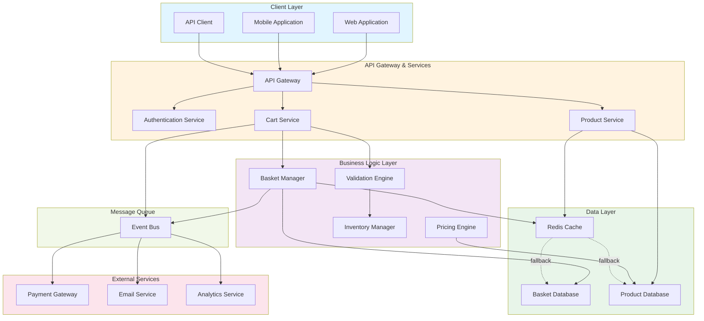
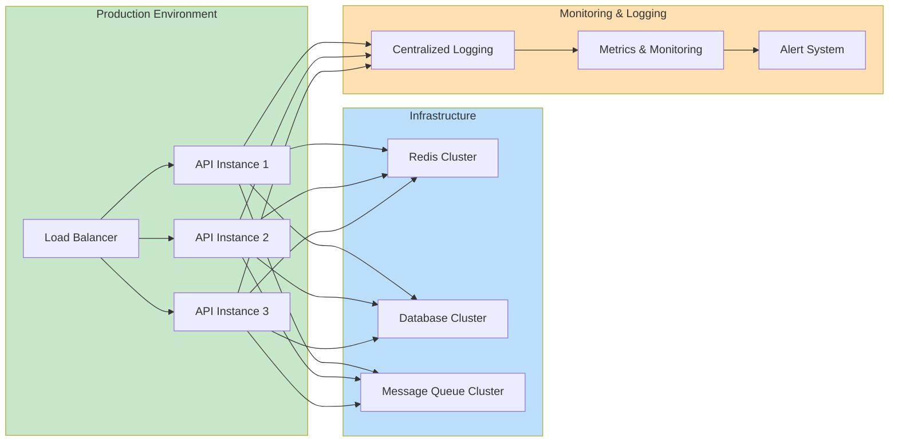

# Basket System Architecture

This document provides an overview of the system architecture for the Basket (Shopping Cart) service.

## System Architecture Overview

## Component Descriptions

### Client Layer
- **Web Application**: Browser-based user interface
- **Mobile Application**: Native or cross-platform mobile app
- **API Client**: Third-party or internal API consumers

### API Gateway & Services
- **API Gateway**: Central entry point for all client requests, handles routing and request orchestration
- **Authentication Service**: Manages user authentication, JWT tokens, and session handling
- **Cart Service**: Orchestrates shopping basket operations
- **Product Service**: Manages product information and catalog

### Business Logic Layer
- **Basket Manager**: Core logic for adding, removing, and updating items in the basket
- **Pricing Engine**: Calculates prices, discounts, and taxes
- **Validation Engine**: Validates items, quantities, and business rules
- **Inventory Manager**: Checks stock availability and reserves items

### Data Layer
- **Basket Database**: Persistent storage for shopping basket data
- **Redis Cache**: In-memory caching for frequently accessed data
- **Product Database**: Product catalog and pricing information

### External Services
- **Payment Gateway**: Processes payment transactions
- **Email Service**: Sends order confirmations and notifications
- **Analytics Service**: Tracks user behavior and basket metrics

### Message Queue
- **Event Bus**: Asynchronous event handling for basket operations, checkout, and order processing

## Data Flow

1. **User adds item to basket**
   - Client → API Gateway → Cart Service → Basket Manager
   - Basket Manager validates item and checks inventory
   - Updates basket database and publishes event to Event Bus

2. **Price calculation**
   - Pricing Engine retrieves product and discount information
   - Calculates total with applicable taxes and promotions

3. **Cache optimization**
   - Frequently accessed products cached in Redis
   - Fallback to database on cache miss

4. **Checkout flow**
   - Event published to Event Bus
   - Triggers Payment Gateway for transaction processing
   - Email Service sends confirmation
   - Analytics Service logs transaction

## Technology Stack (Typical)

| Layer | Component | Technology Options |
|-------|-----------|-------------------|
| API Gateway | Request Routing | nginx, Kong, Express.js |
| Services | Microservices | Node.js, Python, Go, Java |
| Cache | In-Memory Store | Redis, Memcached |
| Database | Primary Storage | PostgreSQL, MySQL, MongoDB |
| Message Queue | Event Bus | RabbitMQ, Kafka, AWS SQS |
| Authentication | Auth Service | OAuth2, JWT, Auth0 |

## Deployment Architecture

## Key Features

- ✅ Scalable microservices architecture
- ✅ High availability with load balancing
- ✅ Caching strategy for performance
- ✅ Asynchronous event processing
- ✅ Comprehensive monitoring and logging
- ✅ Secure authentication and authorization
